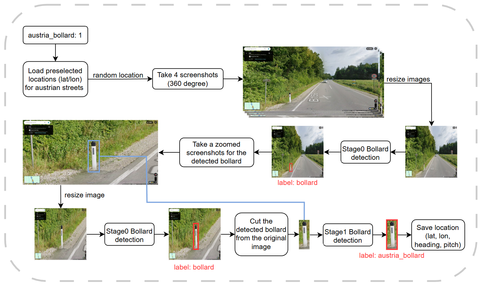
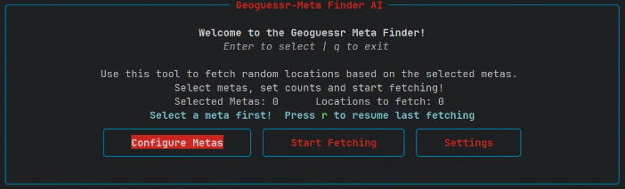
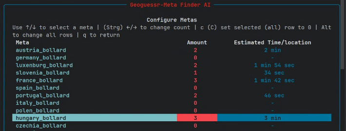
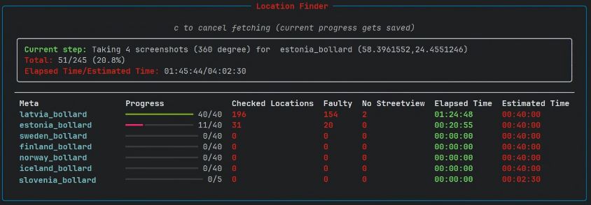
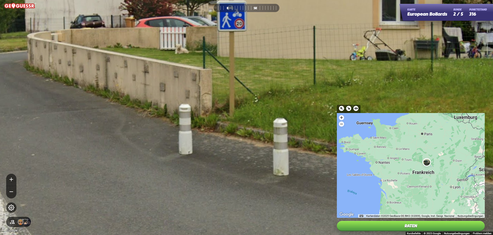

# Automated GeoGuessr Meta Finder
The full paper can be accessed here:

This project implements an automated approach for identifying country-specific bollards in Google Street View imagery.  
The goal is to automatically generate GeoGuessr learning maps by finding locations that contain relevant metas, specifically European road bollards.

A two-stage YOLO pipeline is used:

- **Stage 0:** Detect all bollards in low-resolution Street View screenshots.  
- **Stage 1:** Classify cropped high-resolution bollards into 20+ country-specific classes.

The system performs automated Street View navigation (pan, center, zoom) using Selenium and stores valid bollard locations in a JSON format that can be imported directly into GeoGuessr.

---

## Features

- Automated Street View screenshot capture  
- Two-stage YOLO bollard detection  
- Classification of European bollards from 20+ countries  
- JSON export for direct GeoGuessr import  
- Terminal user interface for selecting metas and fetching locations  

## Application Pipeline


## Application UI
HomeScreen:


Meta Selection Screen:


Fetching Screen:


## Found Locations (examples)
The created map can be accessed here: [GeoGuessr](https://www.geoguessr.com/de/maps/6921ac4376175cf2c2ebe66a) (subscription required).  
Free sample challenges can be accessed here:  
[Sample 1](https://www.geoguessr.com/challenge/DYQWxIN8zLOHH5re),[Sample 2](https://www.geoguessr.com/challenge/sO2muhiRY0paPNyv), and [Sample 3](https://www.geoguessr.com/challenge/IooAJ1YpoqdIXNFa).

Examples:



## Installation

```bash
git clone <your-repo-url>
cd <your-repo-folder>
pip install requirements.txt
python .\script_UI.py 